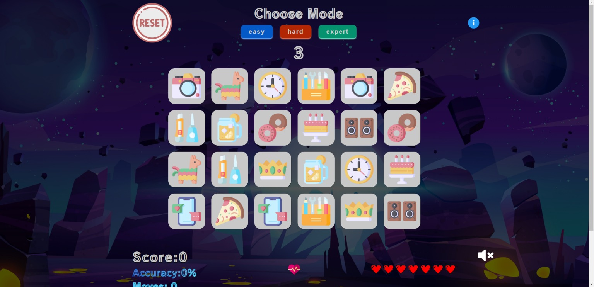

# PuzzlePieces
☻ A Fun generic Memory Game called Puzzle Up. Where the user matches two images but with limited lives to create a focus on memorization 

⚬ this is the first version of the project which is hosted locally.

⚬ the deployed node Version of the project is on the branch nodeVersion which includes code refactoring and also a few npm packages to improve performance.
 
☻ the game is hosted at https://puzzle-up.vercel.app/

<a href="https://puzzle-up.vercel.app/"><a/>
